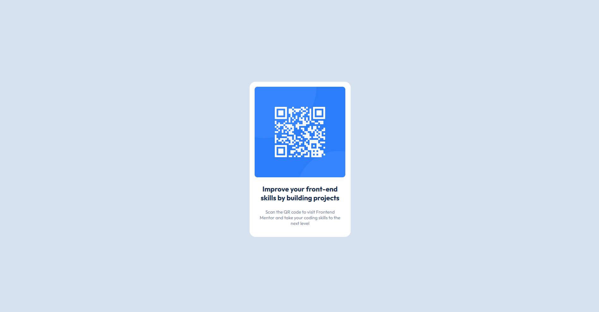

# Frontend Mentor - QR code component solution

This is a solution to the [QR code component challenge on Frontend Mentor](https://www.frontendmentor.io/challenges/qr-code-component-iux_sIO_H). Frontend Mentor challenges help you improve your coding skills by building realistic projects. 

## Table of contents

- [Overview](#overview)
  - [Screenshot](#screenshot)
  - [Links](#links)
- [My process](#my-process)
  - [Built with](#built-with)
  - [What I learned](#what-i-learned)
  - [Continued development](#continued-development)
  - [Useful resources](#useful-resources)
- [Author](#author)
- [Acknowledgments](#acknowledgments)

## Overview

### Screenshot




### Links

- Solution URL: [Add solution URL here](https://htmlpreview.github.io/?https://github.com/ilhanhakan-koc/frontend_qr_challenge/blob/main/index.html)

## My process

### Built with

- Semantic HTML5 markup
- CSS custom properties
- Flexbox

### What I learned

I started to create my css design by using the :root element. It is like using variables in any programming language. So flexible and easy to change. Here is an example snippet of my project solution:

```css
:root {
    --clr-white: hsl(0, 0%, 100%);
    --clr-lgray: hsl(212, 45%, 89%);
    --clr-gblue: hsl(220, 15%, 55%);
    --clr-dblue: hsl(218, 44%, 22%);
    --clr-lblue: hsl(212, 45%, 89%);
    --ff-outfit: 'Outfit', sans-serif;
    --fw-light: 400;
    --fw-bold: 700;
    --fs-header: 1.375rem;
    --fs-text: 0.9rem;
}
```

Example usage:
```css
body {
    font-family: var(--ff-outfit);
    background-color: var(--clr-lblue);
}
```

### Continued development

I will always use it in the future. But I also noticed that I have to practice a lot with flex and grid. I had difficulties displaying the whole thing responsively because I had design errors and did a lot of things wrong with the width option

### Useful resources

- [Google](https://www.google.com) - Best friend :)


## Author

- Frontend Mentor - [@ilhanhakan-koc](https://www.frontendmentor.io/profile/ilhanhakan-koc)


## Acknowledgments

Thank you frontend mentor to give us the opportunity to train our skills. 
Although this challenge wasn't that difficult, I still made mistakes and lost time. I will continue to practice diligently with frontend mentor :)
